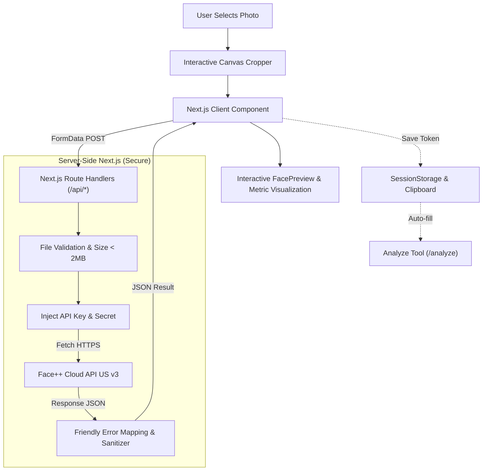

# ✨ Guess Your Face (GYF)

<div align="center">


<br />

**Real-Time AI-Powered Facial Detection, Comparison, and Attribute Analysis Playground.**

*"Guess your face, let AI do the reading."*

[Key Features](#-key-features) • [Evolution & Upgrades](#-evolution--upgrades-from-previous-version) • [Architecture](#-architecture--workflow) • [Installation](#-installation--local-setup) • [API Routes](#-internal-api-endpoints) • [SEO / GEO / AEO / LLMO](#-seo--geo--aeo--llmo-setup)

</div>

---

## 📌 About The Project

**Guess Your Face** is a modern web application powered by artificial intelligence (Face++ Cognitive Services API) to detect micro-expressions, analyze demographic & aesthetic facial profiles, verify similarity between two photos (1:1 face matching), and deeply inspect face tokens.

All image processing is performed **real-time *in-memory*** through secure Next.js Route Handlers, without storing user images on the server or database (Zero Data Retention / Privacy-First).

The codebase ships with **first-class internationalization** (Indonesian + English, instant client-side toggle), **full SEO/GEO/AEO/LLMO discoverability** (JSON-LD, Open Graph, Twitter cards, multilingual sitemap, `llms.txt`), and **premium UX details** (interactive canvas cropper, animated emotion bars, color-coded bounding boxes, accessible focus states, skeleton loading).

---

## 🚀 Evolution & Upgrades from Previous Version

> This project is an **evolution, complete architectural revamp (v2.0), and significant upgrade** from the original repository:  
> 🔗 **[REY-STTP/Facial-Expression-Detection-App](https://github.com/REY-STTP/Facial-Expression-Detection-App)**

### 📊 Version Comparison:

| Aspect / Feature | Previous Version (`v1.0`) 🏛️ | Guess Your Face (`v2.0` - Current) ⚡ |
| :--- | :--- | :--- |
| **Architecture & Tech Stack** | Monolithic Node.js + Express.js + Multer + MongoDB | Modern Full-Stack **Next.js 16 (App Router) + React 19 + TypeScript + Tailwind CSS v4** |
| **Storage & Privacy** | Requires database (MongoDB) for auth/data | **Zero-Storage Privacy-First**: images processed *in-memory* & never stored |
| **Localization (i18n)** | Hardcoded single language | **Built-in ID/EN Bilingual System**: client-side instant toggle, automatic browser detection, and `localStorage` persistence. All UI strings, FAQ, marketing copy, and TL;DR summaries are translated. |
| **Detection Features** | Basic emotion detection with simple text labels | **Multi-Face Detection**: 7 percentage-weighted emotions, age estimation, gender, *smiling score*, *beauty score* (male & female), *face quality*, & 3D *headpose* angles |
| **Comparison Feature (Compare)** | ❌ Not available | ✅ **1:1 Face Verification** with *confidence score* visualization & Face++ *threshold* benchmarks (1e-3, 1e-4, 1e-5) |
| **Token Analysis Feature (Analyze)** | ❌ Not available | ✅ **Deep Batch Inspector** for up to 5 *face tokens* with dynamic filters (including glasses, eye status, & medical mask) |
| **Image Interactivity** | Standard image upload without preprocessing | **Built-in Interactive Canvas Cropper** with *drag/pan* navigation and *zoom slider* |
| **Results Visualization** | Raw / simple text responses | **Interactive Bounding Boxes** on faces, *color-coded animated progress bars*, & modern metric cards |
| **Navigation UX** | Hard page reloads between tools | **Instant soft navigation** with `aria-current`, loading skeletons per route group, and smooth scroll |
| **Design & UI/UX** | Minimalist view | Premium interface with *modern brutalist/minimalist* aesthetics, adaptive **Dark & Light Theme** support, **WCAG AA compliant contrast ($\ge$ 4.5:1)**, robust typography hierarchy (*Inter Variable, Space Grotesk & JetBrains Mono*), Phosphor icons, and interactive notifications via **Sonner** |
| **Discoverability** | None (raw HTML) | **Full SEO stack**: JSON-LD (Organization + WebSite + WebApplication + FAQPage + BreadcrumbList), Open Graph, Twitter cards, multilingual sitemap, `robots.txt` whitelisting 12 AI bots, and `llms.txt` for LLM crawlers |

---

## 🎯 Key Features

### 1. 🔍 Detect Tool (`/detect`)
- **Multi-Face Detection**: Detects all faces in a single photo simultaneously.
- **Interactive Bounding Boxes**: Highlights face positions on the image with index numbers synchronized with the result cards.
- **7 Emotion Spectra**: Percentage-based visualization of emotions (*Anger, Disgust, Fear, Happiness, Neutral, Sadness, Surprise*) with animated progress bars.
- **Comprehensive Metrics**:
  - 👤 **Gender & Age**: Gender prediction and age estimation.
  - 😊 **Smiling Rate**: Smile intensity level (0–100%).
  - ✨ **Beauty Score**: Aesthetic facial scores (average, male perception, and female perception scores).
  - 📐 **3D Headpose**: Head tilt and orientation angles (*Pitch, Roll, Yaw*).
  - 🛡️ **Face Quality**: Clarity and suitability score of facial quality.
- **Auto-Token Handoff**: Face tokens (*face_token*) are automatically saved to `sessionStorage` and clipboard for instant inspection in the *Analyze* tool.

### 2. ⚖️ Compare Tool (`/compare`)
- **1:1 Face Matching**: Compares two photos to determine whether they belong to the same individual.
- **Dual Independent Cropper**: Enables independent cropping and previews for Photo 1 and Photo 2.
- **Confidence Meter**: Calculates matching confidence percentage along with official Face++ error tolerance thresholds (*1e-3, 1e-4, 1e-5*).
- **Visual Indicators**: Provides instant conclusions (*High Match / Same Person / Different Person*).

### 3. 🧬 Analyze Tool (`/analyze`)
- **Face Token Deep Inspector**: Deep attribute analysis for 1 up to 5 *face tokens* simultaneously.
- **Custom Attribute Filters**: Modularly select attributes to fetch:
  - Gender & Age
  - Emotion & Smiling Rate
  - Face Quality & Beauty Score
  - 😷 **Mouth Status**: Detects surgical/medical mask wearing, open mouth, or object occlusion.
  - 👓 **Eye Status**: Detects open/closed eyes, normal glasses, sunglasses, or occlusions.

### 4. 🌐 Bilingual Localization (i18n)
- Full support for **Indonesian (ID)** and **English (EN)** with instant client-side switching, persistent storage (`localStorage` key `gyf-locale`), and automatic browser-language detection on first visit. Single canonical URL — no separate `/en` routes; hreflang is `id-ID` + `x-default` only to avoid 404 signals.
- Translations cover UI labels, error messages, marketing sections (About, tool comparison, FAQ), per-tool TL;DR + step-by-step guides, tooltips, and aria attributes.
- Architecture: type-safe `Dictionary` schema in `lib/i18n/types.ts` with separate `dictionaries/id.ts` and `dictionaries/en.ts`. Server-rendered SEO (JSON-LD, `llms.txt`, `FAQPage`) stays bilingual via `inLanguage: ["id","en"]` so AI answer engines see both languages without needing duplicate routes.

### 5. ✂️ Built-in In-Browser Canvas Cropper
- Users can adjust facial positions, pan/drag, and zoom photos before submitting to the API, ensuring optimal resolution and file size within the 2 MB limit.

### 6. 🧭 Smooth Navigation
- **Soft client-side transitions** between tools with `aria-current` active state, **route-level loading skeletons** (`app/(tools)/loading.tsx`) that mirror the actual layout, and **scroll position preservation** with sticky-header offset (`scroll-padding-top`).

---

## 🛠️ Tech Stack & Dependencies

- **Core Framework**: [Next.js 16 (App Router)](https://nextjs.org/) & [React 19](https://react.dev/)
- **Language**: [TypeScript](https://www.typescriptlang.org/)
- **Styling**: [Tailwind CSS v4](https://tailwindcss.com/) & Native CSS Variables (light + dark themes)
- **Typography**: `@fontsource-variable/inter` (Body), `@fontsource-variable/space-grotesk` (Display/Headings), & `@fontsource-variable/jetbrains-mono` (Code/Data)
- **Icons**: [Phosphor Icons (`@phosphor-icons/react`)](https://phosphoricons.com/)
- **Toaster / Notification**: [Sonner](https://sonner.emilkowal.ski/)
- **Image Processing (dev only)**: [`sharp`](https://sharp.pixelplumbing.com/) (via Next.js dep) for regenerating favicon assets
- **AI Cognitive Engine**: [Face++ Cognitive Services API (US Region v3)](https://www.faceplusplus.com/)

---

## 🏗️ Architecture & Workflow



---

## 📁 Directory Structure

```text
guess-your-face/
├── app/
│   ├── (tools)/                       # Route group — shares the ToolNav layout
│   │   ├── analyze/
│   │   │   ├── page.tsx               # Analyze tool server entry
│   │   │   ├── page.client.tsx        # Client wrapper with localized title
│   │   │   └── opengraph-image.tsx    # Per-tool OG image (1200×630)
│   │   ├── compare/
│   │   │   ├── page.tsx
│   │   │   ├── page.client.tsx
│   │   │   └── opengraph-image.tsx
│   │   ├── detect/
│   │   │   ├── page.tsx
│   │   │   ├── page.client.tsx
│   │   │   └── opengraph-image.tsx
│   │   ├── layout.tsx                 # Tools sub-layout (ToolNav + page)
│   │   └── loading.tsx                # Route-level skeleton (mirrors layout)
│   ├── api/                           # Server-only Face++ proxies
│   │   ├── analyze/route.ts           # POST JSON → Face++ /analyze
│   │   ├── compare/route.ts           # POST multipart → Face++ /compare
│   │   └── detect/route.ts            # POST multipart → Face++ /detect
│   ├── globals.css                    # Global styles, color tokens, & animations
│   ├── layout.tsx                     # Root layout, Toaster & LanguageProvider, Google + Bing verification
│   ├── manifest.ts                    # /manifest.webmanifest (PWA + brand SERP)
│   ├── not-found.tsx                  # Custom 404 (server entry)
│   ├── not-found.client.tsx           # 404 client component (Localized)
│   ├── page.tsx                       # Landing page (server entry) — openGraph.siteName + images for /og-image.png
│   ├── page.client.tsx                # Landing page client wrapper
│   ├── robots.ts                      # /robots.txt with AI bot whitelist
│   └── sitemap.ts                     # Multilingual sitemap (id/en × 4 routes)
├── components/
│   ├── AnalyzeTool.tsx                # Analyze feature controller (client)
│   ├── CompareTool.tsx                # Compare feature controller (client)
│   ├── CropModal.tsx                  # Interactive canvas cropper modal (pan & zoom)
│   ├── DetectTool.tsx                 # Detect feature controller (client)
│   ├── EmotionBars.tsx                # Animated emotion progress bar visualization
│   ├── FacePreview.tsx                # Image preview with responsive Bounding Boxes
│   ├── FaqStructuredData.tsx          # Server: FAQPage JSON-LD (English for SEO)
│   ├── LanguageSwitcher.tsx           # Bilingual ID/EN segmented toggle switch
│   ├── MarketingSections.tsx          # Landing About + tool cards + FAQ (client, localized)
│   ├── SiteFooter.tsx                 # Localized privacy & attribution footer
│   ├── SiteHeader.tsx                 # Application header with logo & switcher
│   ├── StructuredData.tsx             # Server: Organization + WebSite JSON-LD
│   ├── ToolMenu.tsx                   # Feature cards on landing page
│   ├── ToolNav.tsx                    # Navigation tab bar across tools (aria-current)
│   ├── ToolStructuredData.tsx         # Server: WebApplication + BreadcrumbList JSON-LD
│   ├── ToolTldr.tsx                   # Per-tool TL;DR + 4-step "how it works" (client, localized)
│   ├── ui.tsx                         # Reusable UI primitives (Buttons, Dropzone, FaceToken)
│   └── og/
│       └── ToolOgTemplate.tsx         # Shared ImageResponse template for per-tool OG
├── lib/
│   ├── emotions.ts                    # Emotion metadata, color themes, emoji, & helpers
│   ├── facepp.ts                      # Face++ API client, error mapping, & validator
│   ├── i18n/                          # Internationalization core
│   │   ├── context.tsx                # Language React Context & useLanguage hook
│   │   ├── types.ts                   # Type-safe schema definition for dictionaries
│   │   └── dictionaries/              # ID and EN language dictionary files
│   │       ├── en.ts
│   │       └── id.ts
│   └── use-image-upload.tsx           # Custom React Hook for upload & crop lifecycle
├── public/                            # Static assets
│   ├── apple-icon.png                 # 180×180 iOS touch icon
│   ├── favicon.ico                    # 16/32/48 multi-image ICO
│   ├── icon-192.png                   # 192×192 Android home screen
│   ├── icon-512.png                   # 512×512 PWA large icon
│   ├── icon.png                       # 512×512 source favicon
│   ├── llms-full.txt                  # Long-form Markdown for LLM crawlers
│   ├── llms.txt                       # Short-form site summary for LLM crawlers
│   ├── logo.png                       # 1254×1254 high-res brand logo (Organization JSON-LD)
│   └── og-image.png                   # 1200×630 static OG/Twitter card for homepage
├── .env.example                       # Environment variables template
├── next.config.ts                     # Next.js config (allowedDevOrigins)
├── package.json                       # Dependencies & npm scripts
├── proxy.ts                           # Canonical-domain proxy (Next.js 16's middleware.ts)
└── tsconfig.json                      # TypeScript configuration
```

---

## 💻 Installation & Local Setup

### Prerequisites:
- [Node.js](https://nodejs.org/) version 18.18+ or 20+
- Account and API Credentials from [Face++ (Megvii)](https://www.faceplusplus.com/)

### Step 1: Clone Repository
```bash
git clone https://github.com/REY-STTP/guess-your-face.git
cd guess-your-face
```

### Step 2: Install Dependencies
```bash
npm install
```

### Step 3: Configure Environment Variables
Copy `.env.example` to `.env.local`:
```bash
cp .env.example .env.local
```

Open `.env.local` and fill in your Face++ credentials:
```env
# Face++ API credentials — https://www.faceplusplus.com/
FACEPP_API_KEY=your_faceplusplus_api_key_here
FACEPP_API_SECRET=your_faceplusplus_api_secret_here

# Public site URL — used for canonical, sitemap, Open Graph, JSON-LD, and llms.txt.
NEXT_PUBLIC_SITE_URL=https://your-site-domain
```

### Step 4: Run Development Server
```bash
npm run dev
```

Open [http://localhost:3000](http://localhost:3000) in your browser.

### Step 6: Build for Production
```bash
npm run build
npm run start
```

### Available npm Scripts

| Script | Description |
| :--- | :--- |
| `npm run dev` | Start Next.js dev server with hot reload |
| `npm run build` | Production build |
| `npm run start` | Start the production server |
| `npm run lint` | Run ESLint with `eslint-config-next` |

---

## 🔌 Internal API Endpoints

This application provides internal Next.js Route Handlers that isolate API credentials from the client side:

| Endpoint | Method | Input Body | Description |
| :--- | :--- | :--- | :--- |
| `/api/detect` | `POST` | `multipart/form-data` (`file`) | Sends image to Face++ `/detect` and returns detected faces with all extracted attributes. |
| `/api/compare` | `POST` | `multipart/form-data` (`file1`, `file2`) | Compares 2 facial photos and returns matching *confidence* score along with *thresholds*. |
| `/api/analyze` | `POST` | `application/json` (`{ faceTokens, attributes }`) | Fetches deep attributes for an array of registered *face tokens*. |

---

## 🔒 Privacy & Security

1. **Zero Data Retention**: Uploaded images are processed directly in memory (*buffer/stream*) and forwarded to the Face++ API. No images are saved to local disk, servers, or databases.
2. **Protected Credentials**: API keys (`FACEPP_API_KEY` and `FACEPP_API_SECRET`) are accessed exclusively on the server (*server-side route handlers*) and never exposed to the client bundle.
3. **Strict File Validation**: Validates MIME types (`image/jpeg`, `image/png`) and enforces a maximum file size limit of 2 MB before dispatching requests to the external API.
4. **Canonical Domain Enforcement**: `proxy.ts` runs at the edge (Node.js runtime in Next.js 16) and 308-redirects any non-canonical host (preview URLs, alternate TLDs) to the production domain in production. In development it is a no-op so `localhost` keeps working.

---

## 👤 Author & License

Created with ❤️ by **[REY-STTP](https://github.com/REY-STTP)**.

Distributed under the MIT License. See `LICENSE` for more information.

---

## 🔍 SEO / GEO / AEO / LLMO Setup

This project ships with first-class discoverability built in: technical SEO, structured data, Open Graph cards, AI-crawler friendly routing, multilingual support, and `llms.txt` description files.

### Canonical Domain

The production domain is **`https://www.guess-your-face.web.id`**. A [`proxy.ts`](./proxy.ts) at the repo root (Next.js 16's replacement for `middleware.ts`, runs on the Node.js runtime) forces a **308 Permanent Redirect** to the canonical host from any other origin (preview URLs, the legacy Vercel domain `guess-your-expression.vercel.app`, or the apex without `www`).

The proxy **pass-throughs client-side navigation** (requests carrying the `Next-Router-State-Tree` header or `purpose: prefetch`, and `?_rsc=...` data fetches) so soft navigation never 308-loops when the user lands on a non-canonical host. The proxy is a no-op in development so `localhost:3000` keeps working.

### Files That Power Discoverability

| Concern | File | Purpose |
| :--- | :--- | :--- |
| Crawler policy | [`app/robots.ts`](./app/robots.ts) | Generates `/robots.txt` allowing all major crawlers plus 12 AI bots (`GPTBot`, `PerplexityBot`, `ClaudeBot`, `Google-Extended`, `CCBot`, `Bytespider`, `Amazonbot`, `Applebot-Extended`, `cohere-ai`, `Diffbot`, `FacebookBot`, `Meta-ExternalAgent`). |
| Sitemap | [`app/sitemap.ts`](./app/sitemap.ts) | Emits 4 canonical URLs (`/`, `/detect`, `/compare`, `/analyze`) with `id-ID` + `x-default` hreflang — single-URL site, client-side i18n toggle, no `/en` duplicates. |
| PWA manifest | [`app/manifest.ts`](./app/manifest.ts) | Generates `/manifest.webmanifest` with favicon.ico + 192×192 + 512×512 icons (any + maskable) for mobile install + brand SERP. |
| Favicon assets | `public/favicon.ico`, `apple-icon.png`, `icon-192.png`, `icon-512.png` | Multi-size icon set generated from `public/icon.png` (canonical 512×512 logo). |
| Root structured data | [`components/StructuredData.tsx`](./components/StructuredData.tsx) | Renders `Organization` (with `logo` + `image` + `caption` for Knowledge Panel eligibility) + `WebSite` JSON-LD (brand entity, sitelinks searchbox). |
| Per-tool structured data | [`components/ToolStructuredData.tsx`](./components/ToolStructuredData.tsx) | Renders `WebApplication` + `BreadcrumbList` JSON-LD on `/detect`, `/compare`, `/analyze`. |
| FAQ JSON-LD | [`components/FaqStructuredData.tsx`](./components/FaqStructuredData.tsx) | Renders `FAQPage` JSON-LD on the landing page (English for global SEO crawlers; the visible FAQ is localized via `MarketingSections`). |
| Open Graph root | `public/og-image.png` | Static 1200×630 OG image served by Next.js file convention; referenced via `metadata.openGraph.images` + `metadata.twitter.images` for predictable URL and CDN caching. |
| Open Graph per-tool | `app/(tools)/{detect,compare,analyze}/opengraph-image.tsx` | Per-tool branded 1200×630 OG images (dynamic, with hash-suffix routing). |
| About + FAQ content | [`components/MarketingSections.tsx`](./components/MarketingSections.tsx) | Client component (so it can swap language at runtime): About, 4-stat block, tool comparison cards, and 10 Q&A in the active locale. |
| Per-tool TL;DR | [`components/ToolTldr.tsx`](./components/ToolTldr.tsx) | Client component: 40–60 word answer-first summary + 4-step ordered list per tool, all localized. |
| LLMs description | [`public/llms.txt`](./public/llms.txt) + [`public/llms-full.txt`](./public/llms-full.txt) | Structured site summary for `GPTBot`, `PerplexityBot`, `ClaudeBot`, etc. |
| Canonical redirect | [`proxy.ts`](./proxy.ts) | 308 redirect to `www.guess-your-face.web.id` in production; pass-through for client navigation + AI prefetch headers. |

### Environment Variables

Add to `.env.local` (already committed for this project, **do not commit your own**):

```env
FACEPP_API_KEY=your_faceplusplus_api_key
FACEPP_API_SECRET=your_faceplusplus_api_secret
NEXT_PUBLIC_SITE_URL=https://www.guess-your-face.web.id
```

`NEXT_PUBLIC_SITE_URL` is the source of truth for every absolute URL the app emits — sitemap entries, Open Graph images, canonical links, JSON-LD `url` fields, and `llms.txt` references. Override it per environment if you preview under a different host.

### Post-Deploy Steps

1. **Google Search Console**
   - Property → URL prefix → `https://www.guess-your-face.web.id`
   - Verification: HTML tag (the token is already wired into `app/layout.tsx`)
   - Sitemaps → submit `https://www.guess-your-face.web.id/sitemap.xml`
   - URL Inspection → request indexing for `/`, `/detect`, `/compare`, `/analyze`

2. **Bing Webmaster Tools**
   - Add site → `https://www.guess-your-face.web.id`
   - Verification: HTML tag (the `msvalidate.01` token is wired into `app/layout.tsx` via `verification.other`)
   - Sitemaps → submit `https://www.guess-your-face.web.id/sitemap.xml`
   - (Optional) Enable **IndexNow** for instant URL submission

3. **Rich Results Validation**
   - https://search.google.com/test/rich-results → check `/`, `/detect`, `/compare`, `/analyze`
   - https://validator.schema.org/ → independent JSON-LD check

4. **Open Graph Preview**
   - https://www.opengraph.xyz/ → check share preview for every URL
   - https://cards-dev.twitter.com/validator → confirm Twitter cards

### Why This Matters

| Layer | What it does |
| :--- | :--- |
| **SEO** | Brand name appears in SERP (not the Vercel default domain), per-tool titles are unique, sitemap + hreflang consolidate bilingual URLs, multi-size favicons are SERP-eligible. |
| **GEO** | Generative engines (Google AI Overviews, Perplexity, ChatGPT Search) can quote the FAQ, the About section, and the `llms.txt` definitions verbatim because they are server-rendered HTML. |
| **AEO** | `FAQPage` schema + 40–60 word answers + comparison table make every URL eligible for featured snippets and voice answers. |
| **LLMO** | `llms.txt` + `llms-full.txt` give LLM crawlers a structured summary without needing to render the entire JavaScript bundle. The 12-AI-bot whitelist in `robots.ts` explicitly invites them in. |
